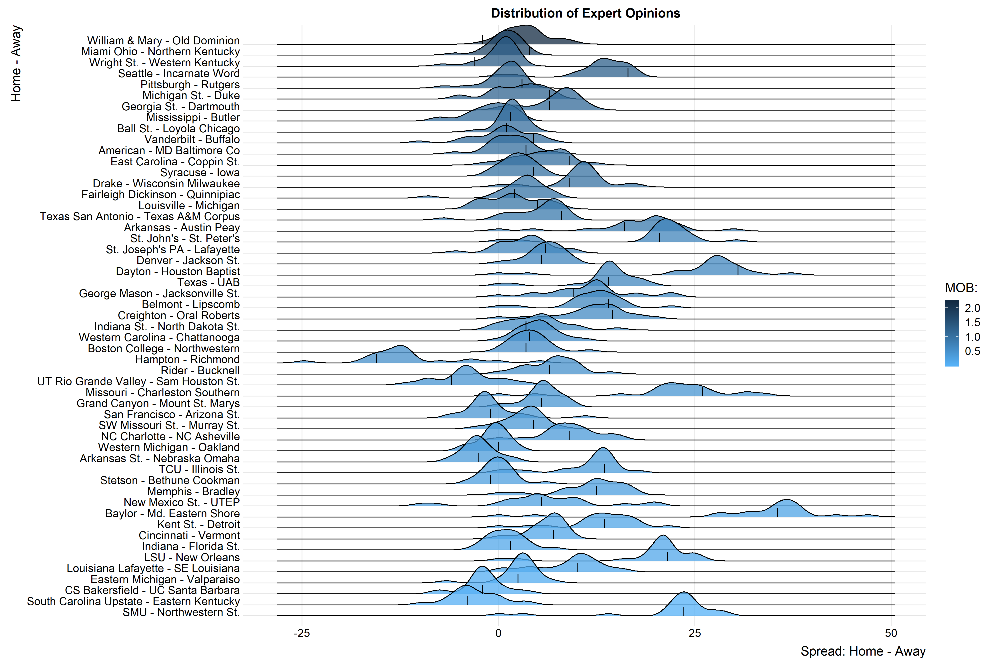

We first need to familiarize ourselves with the tidyverse syntax, specifically the *piping* function `%>%`. Consider the following example:

```{r}
sup <- function(x) suppressWarnings(suppressMessages(x))

# load dependencies
#install.packages("tidyverse")
sup(library(tidyverse))

samp <- runif(10, 0, 1)

# base syntax
round(exp(diff(log(samp))), 1)

# tidy syntax
samp %>% 
  log(.) %>% 
  diff(.) %>% 
  exp(.) %>% 
  round(., 1)

# clear environment
rm(samp)
```

As exemplified, the `%>%` takes the object to its left and *pipes* it into the next function. The `.` indicates where the piped object belongs in the functions arguments. For functions that take only one argument, such as `exp`, the pipe is not necessary but recommended for consistency.

# Scraping

Using this syntax, we begin by scraping play by play data from Colorado State's basketball games to date. The data are publically available from [ESPN](https://www.espn.com/mens-college-basketball/playbyplay?gameId=401173680). We will use the `ncaahoopR` and `rvest` packages.

```{r}
#install.packages("rvest")
#install.packages("ncaahoopR")
sup(library(rvest))
sup(library(ncaahoopR))

# get play by play
gids <- c("401168162", "401173646", "401173659", "401173680", "401173666")
pbp <- get_pbp_game(gids)
pbp

#-------------------------------------------------------------------------------
# get date of game
#-------------------------------------------------------------------------------
# get more data by scraping
url <- str_c("https://www.espn.com/mens-college-basketball/matchup?gameId=",
             gids)

# check to see if the html table is easily parsed
url[1] %>%
  read_html() %>%
  html_nodes(., ".game-date")

# find easily parsable source
url_a <- str_c("https://www.espn.com/mens-college-basketball/recap?gameId=",
             gids)

# check to see if the html table is easily parsed
url_a[1] %>%
  read_html() %>%
  html_nodes("span") %>%
  html_text() %>%
  str_subset(., "2019") %>%
  .[1]

# create function to extract date
get_date <- function(url){
  res <- url %>%
    read_html() %>%
    html_nodes("span") %>%
    html_text() %>%
    str_subset(., "2019") %>%
    .[1]
  
  return(res)
}

# get tibble of date by gameid
dates <- tibble(game_id = gids, date = unname(sapply(url_a, get_date)))
dates

# clear environment
rm(gids, get_date, url, url_a)
```

This has only scratched the surface with web scraping. Many websites work hard to ensure you can't scrape their data (easily). My overarching suggestions would be to first try a CSS selector before exploring the page source. This can be the frustrating part of working with real data, but with trial and error (and Google), the needed data can be attained largely with packages like `rvest`.

# Wrangling

To exemplify the usefulness of Tidyverse tools, we will work with the play by play dataset. As a start, we should combine the information contained in various sources by a common key or attribute. This is called *joining*. While there are several types of joins, the most common by far is a left join.

```{r}
sup(library(lubridate))

dt <- pbp %>%
  select(., -date, play_desc = description) %>%
  left_join(., dates) %>%
  filter(play_desc != "End of Game|Play|End of 1st half") %>%
  mutate(., date = lubridate::mdy(date),
         score_inst = if_else(score_diff != lag(score_diff, default = 0), 
                              score_diff - lag(score_diff, default = 0), 
                              0)) %>%
  select(., date, game_id, half, play_id, time_left = secs_remaining, 
         home, home_score, play_desc, away_score, away, 
         score_diff, score_diff, score_inst,
         spread = home_favored_by, win_prob)

write_csv(dt, "../data/csu-basketball-2019.csv")
  
# clear environment
rm(dates, pbp)
```

So far, we've seen how to use `select` to remove, reorder, and rename columns, `left_join` to merge a smaller dataset to a larger dataset rowwise by a common unique key, and `mutate` to edit existing columns and define new columns from existing columns. There are a laundry list of functions in the `dplyr` package used to wrangle data and functions in the `tidyr` package used to restructure data. Both packages are members of the Tidyverse, a group of packages created with the philosophy of structured data with observations as the rows and variables as the columns.

We are going to cover some of the most popular and useful functions:

1. `filter()`: to select observations based on their values
2. `arrange()`: to reorder observations
3. `select()`: to select (and reorder) variables based on their names
4. `mutate()`: to add new variables that are functions of existing variables
5. `group_by()`: to partition a dataset into specified groups of observations, allowing from *grouped* operations
6. `summarize`: to condense multiple observations into a single value

Several useful helper functions (in no particular order) are

1. `row_number()`
2. `case_when()`
3. `first()` and `last()`
4. `desc()`
5. `everything()`
6. `fill()`
7. `n()`

To exemplify these concepts, we will recreate some game summary statistics. To do this, we will need to introduce the idea of grouping. Grouping allows us to partition our dataframe according to *grouping variables* and conduct operations independently on these partitions. If we wish to create game summary statistics, the natural grouping variable is `game_id`, implying any operations that occur in the grouped dataframe will be for each seperate game. We'll start with game field goal and free throw percentage.

```{r}
dt %>%
  mutate(., ft_attempt = str_detect(play_desc, regex("free", ignore_case = TRUE)),
         fg_attempt = str_detect(play_desc, regex("made|missed", ignore_case = TRUE)) & !ft_attempt,
         shot_made = str_detect(play_desc, regex("made", ignore_case = TRUE))) %>%
  group_by(., game_id) %>%
  summarize(., fg_made = sum(shot_made & fg_attempt), fg_taken = sum(fg_attempt), fg_pct = fg_made/fg_taken,
            ft_made = sum(shot_made & ft_attempt), ft_taken = sum(ft_attempt), ft_pct = ft_made/ft_taken) %>%
  ungroup(.)
```

It may be interesting to see how one of our best player's Nico Carvacho shoots over time. This would require us to *filter* plays involving Nico. To assess his performance over time, it would be helpful to *arrange* the game in chronological order.

```{r}
nico <- dt %>%
  arrange(., date) %>%
  filter(., str_detect(play_desc, regex("nico", ignore_case = TRUE))) %>%
  mutate(., ft_attempt = str_detect(play_desc, regex("free", ignore_case = TRUE)),
         fg_attempt = str_detect(play_desc, regex("made|missed", ignore_case = TRUE)) & !ft_attempt,
         shot_made = str_detect(play_desc, regex("made", ignore_case = TRUE))) %>%
  group_by(., date, game_id, half) %>%
  summarize(., n_touches = n(), pts = sum(abs(score_inst)), 
            fg_taken = sum(fg_attempt), fg_pct = sum(shot_made & fg_attempt)/fg_taken,
            ft_taken = sum(ft_attempt), ft_pct = sum(shot_made & ft_attempt)/ft_taken) %>%
  ungroup(.)
nico
```

# Visualization

The Tidyverse, particularly `ggplot`, is known for its ease of use in creating beautiful graphics. That said, we first need to understand the structure of a `ggplot` argument. All plotting requires three things

1. data
2. aesthetic maps: a visual feature that can be used to represent the desired properties you'd like to display. Examples include `x`, `y`, `color`, etc.
3. geometric objects: a command describing how the aesthetics are connected. Think of this as what you actually see. Examples include `geom_point`, `geom_density`, `geom_line`, `geom_bar`, `geom_polygon`, `geom_ribbon`, etc.

There are other options such as

1. stat: a statistical transformation of the data
2. scales: think labels and legends
3. coord: a manipulation of the coordinate system
4. facet: a specification describing how to break up the data into subsets and display those in subplots.


These options are mostly used to fine tune your graph and won't be covered in the interest of time (with the exception of a facet). We'll start with a basic scatterplot.

```{r}
nico <- dt %>%
  group_by(., game_id, half) %>%
  summarize(., pts_in_half = if_else(all(home == "Colorado State"), 
                                    sum(score_inst[which(score_inst > 0)]),
                                    abs(sum(score_inst[which(score_inst < 0)])))) %>%
  ungroup(.) %>%
  left_join(nico, .) %>%
  mutate(., pct_pts = pts/pts_in_half) %>%
  select(half, n_touches, pts, pct_pts)

ggplot(data = nico, 
       aes(x = n_touches, y = pts, color = pct_pts)) +
  geom_point() +
  labs(x = "number of touches", y = "points scored", title = "Points Scored by Number of Touches for Nico Carvacho") +
  scale_color_gradient("% Nico", low = "#56B1F7", high = "#132B43") +
  theme_bw()
```

We can also construct line plots in a similar fashion.

```{r}
score_diff <- dt %>%
  mutate(., st_csu = if_else(home == "Colorado State", score_diff, -score_diff),
         st_lab = paste0(home, " - ", away))

ggplot(data = filter(dt, 	game_id == 401168162), 
       aes(x = (2400 - time_left)/60, y = score_diff)) +
  geom_line() +
  geom_hline(yintercept = 0, linetype = "dashed", color = "red") +
  labs(x = "game time (m.)", y = "score differential: Duke - CSU", title = "Score Differential Across Regulation") +
  theme_bw()
```

We can do this for all games at once.

```{r}
ggplot(data = score_diff, 
       aes(x = (2400 - time_left)/60, y = score_diff, group = game_id)) +
  geom_line() +
  geom_hline(yintercept = 0, linetype = "dashed", color = "red") +
  facet_wrap(~st_lab) +
  labs(x = "game time (m.)", y = "score differential: home - away", title = "Score Differential Across Regulation") +
  theme_bw()
```

The options using ggplot are expansive. Play with it and have fun! I hope this tutorial was helpful!




# Resources

* [Package reference guide](https://support.rstudio.com/hc/en-us/articles/201057987-Quick-list-of-useful-R-packages)
* [RStudio cheatsheets](https://rstudio.com/resources/cheatsheets/)
* [R Bloggers](https://www.r-bloggers.com/)
* [DataCamp](https://www.datacamp.com/)